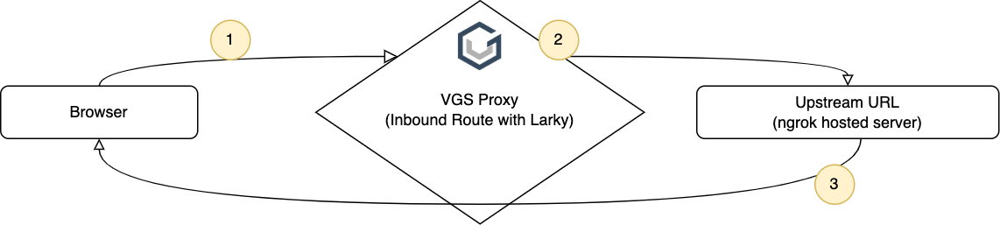

# VGS Solutions Engineer Test Task

This test requires you to intercept a web form submission using the VGS Inbound Route proxy and transform the request payload using [Larky](https://www.verygoodsecurity.com/docs/guides/larky_overview). You will not modify or change any of the code in the server. You are to include your Larky code in the YAML file where instructed.

## Setup 

0. Sign up for a free account at [VGS](dashboard.verygoodsecurity.com), so that you have access to the Vault Dashboard. Send your Vault ID (it should begin with "tnt", like `tntsxzwwlwf`) to your recruiter or support@verygoodsecurity.com and ask them to enable Larky on that vault. It is recommended to go to Routes and make an Inbound Route, then send requests with Postman or Curl until you understand how the VGS Proxy aliases your payload according to the settings you set. 

1. Download the server from github: 
```
git clone https://github.com/OmegaPointZero/testTask.git
cd testTask
```

2. Install the requirements and run the server: 
```
pip3 install -r requirements.txt
python3 manage.py runserver
```
You  now access the server at `http://127.0.0.1:8000/`. To make your server internet acccessible to integrate with VGS without needing to change your router settings or enable port forwarding, we will use [NGROK](https://ngrok.com/), but any service you wish to use will work.

3. Download [ngrok](https://ngrok.com/download), and run it on your machine, pointing it to the same port that your server is running on:
`ngrok http 8000`. Your local server will now be accessible via the URLs provided from NGROK. 

4. Go to your VGS Dashboard, and if you have an inbound route, delete it. Create a new inbound route, replacing the upstream from the VGS Echo Server to your NGROK URL. Save it, and at the top right, select "Export YAML". Save this file, and follow the [instructions here](https://www.verygoodsecurity.com/docs/guides/larky_overview#how-to-use-larky-operation) (#5) to find where your Larky script will go. 

5. When accessing the server, you should not use the localhost address or the NGROK address. Instead, on the top right of your dashboard, you should see a link that says "Vault URLs", listing an inbound and an outbound one. The inbound one should look like "https://tntsxzwwlwf.sandbox.verygoodproxy.com", with your vault ID being the prefix. Access the home page by visiting your Vault URL. You are now ready to begin.

## Building the Integration

### Part A: Restructure and Redact JSON data in-transit



#### 1. Submit card data to /batch endpoint

The Home page has a pre-loaded html form with information for 3 credit card transactions. Submitting the form will POST the data to the `/batch` endpoint. The payload in this request will be a single-layered JSON object, labelled according to which transaction they belong to. An example input:
```
{
  "Name1":"Joosh",
  "CC1":"4111111111111111",
  "CVV1":"999",
  "Amount1":"999.99",
  
  "Name2":"Mony",
  "CC2":"4342561104692751",
  "CVV2":"999",
  "Amount2":"999999.99",
  
  "Name3":"Travis",
  "CC3":"4342561535868087",
  "CVV3":"333",
  "Amount3":"777"
}
```

#### 2. Use Larky to restructure data and redact credit card number

You will need to modify the JSON Payload in-transit and create a new JSON structure using a Larky operation. In order to modify the JSON, you need to do the following:

* Create a list of JSON objects to contain each transaction, with the attributes `Name`, `CC`, `CVV`, and `Amount`.  These shall be placed in a list named `payments`
* Create a `batchSignature` of this batch of transactions by doing the following: 
 * For each transaction, concatenate the `Name`, `CC`, `CVV`, and `Amount`. This concatenated string shall be passed as the input to a SHA384 hash.
 * The outputs of the SHA384 hashes shall be concatenated together, in order, and passed as the input to a SHA512 hash. This hash shall be written as a *hexadecimal* string to `batchSignature`
* You will need to Alias the credit card numbers, so that the raw card numbers in each of the `payments` list are replaced with VGS Tokens. There are two ways of doing this:
 * You can call `vault.put()` in the Larky script to take a value and get its alias.
 * You can leave the object in this format, and create another filter in this route after the Larky script that targets the location using the JSON option on the dashboard. 
* The final object should be in this format:
```
{
  "batchSignature": "<string>",
  "payments": [
    {
      "Name": "Joosh",
      "CC": "<tokenized card number>",
      "CVV": "999",
      "Amount": "999.99"
    },
    {
      "Name": "Mony",
      "CC": "<tokenized card number>",
      "CVV": "999",
      "Amount": "999999.99"
    },
    {
      "Name": "Travis",
      "CC": "<tokenized card number>",
      "CVV": "999",
      "Amount": "777"
    }
  ]
}
```

Write your Larky logic within the `process()` function of the default Larky script. The `process()` function is the one that operates on the payload. When you are ready, you can upload this to your Dashboard (either on the web GUI or using the CLI). If everything happens correctly, when you visit the home page and click "Submit" on the first form, you will see the text of the JSON object populate under the form, with the batch signature, and the list of `payments` objects with each credit card number replaced with an alias.

#### 3. Server responds to browser
The server will return the modified data to the browser so it can be used in Part B of this integration.

##### Hints
* Larky script is written to be identical to python whenever possible. 
* Larky has ported [PyCryptodome](https://pycryptodome.readthedocs.io/en/latest/src/introduction.html) for cryptographic operations. Other cryptography libraries will not be available.
* There are a few differences between Larky and Python that you can see [here](https://docs.bazel.build/versions/main/skylark/language.html#differences-with-python) (ie, `from Crypto.Hash import SHA1` becomes `load("@vendor//Crypto/Hash/SHA1", SHA1="SHA1"`)
* If you are having trouble, it may be easiser to write your logic in Python first.
* You can use the [VGS CLI](https://www.verygoodsecurity.com/docs/vgs-cli/getting-started) to debug requests and get a stack trace from your error messages.
* Make sure the rules about the endpoint get updated to trigger on `/batch` and not `/post`. 

### Part B: Prepare the data for verification in-transit


1. Submit the response from the previous task to the /verify endpoint
2. Use Larky to modify the JSON payload in-transit. This payload needs to be adjusted in the following ways:
* Every one of the VGS Aliases representing the credit card number has to be revealed back into its original value. 
* Each of the `payment` objects will need to create a `transactionID` attribute by performing the following:
   * Concatenate the `Name`, `CC`, `CVV` and `Amount` strings together, and feed this to a SHA384 hash. 
   * Set the `transactionID` attribute of this object to the base64 encoded digest of the SHA384 hash.
```TODO: Add example of restructured data```
 
3. Server responds to browser

If this operation completed successfully, you should see the following message in the browser:
```
{"message":"Success: 3 successful transactions"}
```

#### Hints

* You can create additional filters by copying and pasting the contents under an entry from `data.attributes.entries`, and adding it to the list. You will need to manually update the rules and UUID under `id` this way.
* You can also create an additional filter on the dashboard, setting your endpoint rules and saving the configuration before you export it and edit the `operations` attribute.
* Each Rule filter will execute in sequential order. 

Good Luck!
